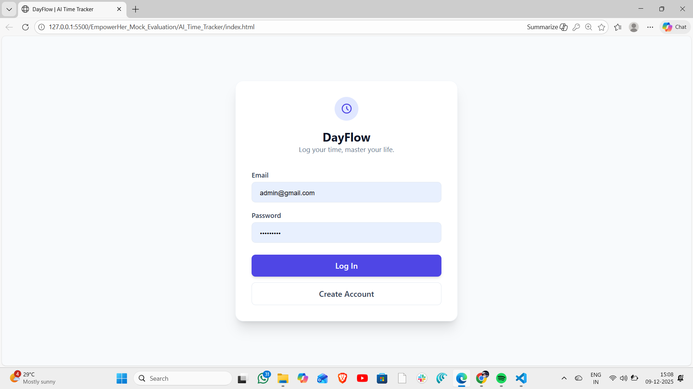
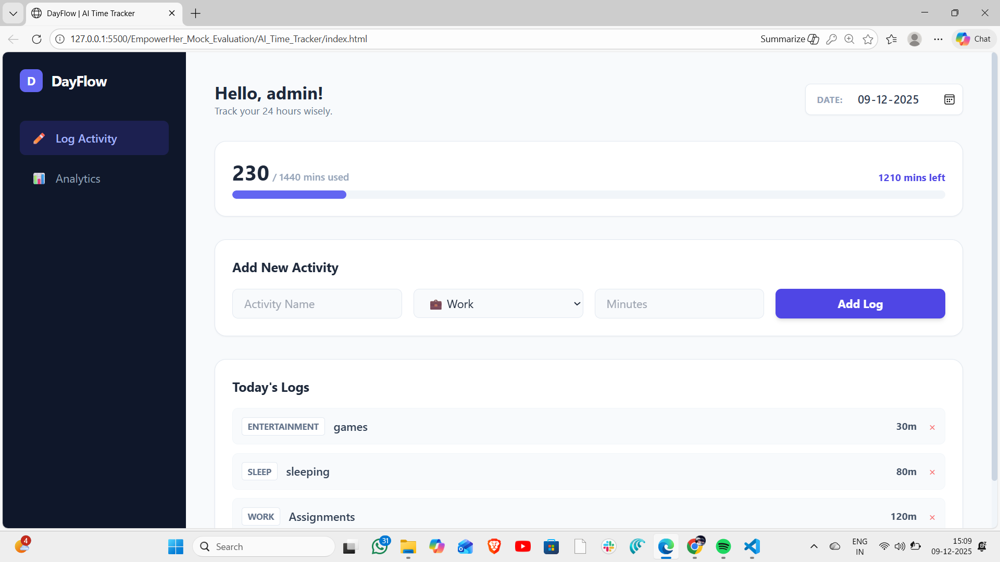

# ⏳ AI-Powered Daily Time Tracking & Analytics Dashboard

A smart, responsive web application that helps users log their daily activities, enforcing a strict 24-hour (1440-minute) limit, and visualizes productivity through an interactive analytics dashboard.

---

## 🔗 Live Demo & Walkthrough

| Type | Link |
|------|------|
| **🚀 Live Application** | **[CLICK HERE TO VIEW DEPLOYED APP](https://github.com/sahithip04/EmpowerHer_Mock_Evaluation/tree/main/AI_Time_Tracker)** |
| **🎥 Video Walkthrough** | [Click to watch video](https://drive.google.com/file/d/1KYZlVPu480yoGhmq5QFNT8vBBY3z9jvE/preview) |


> **Video Highlights:**
> - User Authentication (Sign up/Login).
> - "No Data Available" empty state visualization.
> - Adding activities with the **1440-minute validation logic**.
> - AI-Powered "Burnout Warning" in the dashboard.

---

## 📌 Problem Statement
Time is finite. Many users struggle to track exactly how their 24 hours are spent. This application provides a seamless interface to log activities in minutes, ensuring the total never exceeds a physical day, and provides immediate visual feedback on productivity versus leisure.

---

## 🛠 Tech Stack

*   **Frontend:** HTML5, CSS3 (Tailwind CSS via CDN), Vanilla JavaScript (ES6).
*   **Backend / Database:** Google Firebase (Authentication & Firestore).
*   **Analytics / Charts:** Chart.js.
*   **AI Tools Used:** ChatGPT (GPT-4o) & Claude 3.5.

---

## 🌟 Key Features

### 1. 🔐 User Authentication
*   Secure Login and Sign-up using Firebase Auth.
*   Data is private and synced per user.

### 2. 📝 Smart Activity Logging
*   Select any date via a native date picker.
*   Log activities by Category (Work, Study, Sleep, etc.).
*   **Real-time Validation:** Prevents users from logging more than 1440 minutes (24 hours) in a single day.
*   **Visual Progress Bar:** Shows exactly how much time is left in the day.

### 3. 📊 Analytics Dashboard
*   **"Analyse" Button:** Generates a report for the selected date.
*   **Visualizations:** Interactive Doughnut Chart showing time distribution.
*   **Productivity Score:** auto-calculated based on "Work" and "Study" hours.

### 4. 🤖 AI Integration
*   **Smart Insights:** The app analyzes the total hours worked.
*   **Burnout Detection:** If "Work" exceeds 10 hours, an AI-generated warning message appears suggesting a break.
*   **Motivational Prompts:** If productivity is low, it suggests the Pomodoro technique.

### 5. 🎨 UI/UX Design
*   Fully Responsive (Mobile & Desktop).
*   Clean "Empty State" UI when no data exists for a date.
*   Modern Glassmorphism aesthetics using Tailwind CSS.

---

## 🤖 How AI Was Used in Development
Per the project requirements, Artificial Intelligence played a crucial role in building this application:

1.  **Code Scaffolding:** I used **ChatGPT** to generate the initial HTML structure and Tailwind CSS classes to ensure a modern, responsive layout without writing CSS from scratch.
2.  **Logic Generation:** The complex validation logic (`totalMinutes <= 1440`) and the algorithm to merge array data in Firestore were optimized using AI prompts.
3.  **Creative Features:** The "Burnout Risk" logic in `app.js` was suggested by AI to add a layer of intelligence to the raw data.

---

## 💻 How to Run Locally

Since this project uses Vanilla JS and CDN links, it is lightweight and easy to run.

### Prerequisites
*   VS Code (recommended).
*   A Firebase Project (for your own API keys).

### Steps
1.  **Clone the Repository**
    ```bash
    git clone https://github.com/your-username/your-repo-name.git
    cd your-repo-name
    ```

2.  **Configure Firebase**
    *   Open `app.js`.
    *   Replace the `const firebaseConfig` object with your own credentials from the Firebase Console.
    *   *Note: Ensure Firestore Database Rules are set to `allow read, write: if request.auth != null;`*.

3.  **Run the App**
    *   **Option A (VS Code):** Install the "Live Server" extension, right-click `index.html`, and select "Open with Live Server".
    *   **Option B (Direct):** Simply double-click `index.html` to open it in your browser.

---

## 📸 Screenshots

| Login Screen | Dashboard (With Data) |
|:---:|:---:|
|  |  |


## 🚀 Future Improvements
*   [ ] Dark Mode toggle.
*   [ ] Export weekly reports as PDF.
*   [ ] Social sharing features to compare productivity with friends.

---

**Submitted by:** [Palaparthi Sahithi]  
**GitHub:** [https://github.com/sahithip04]